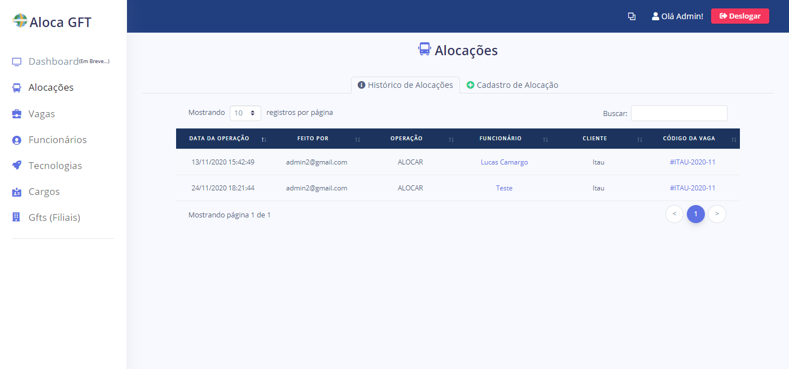
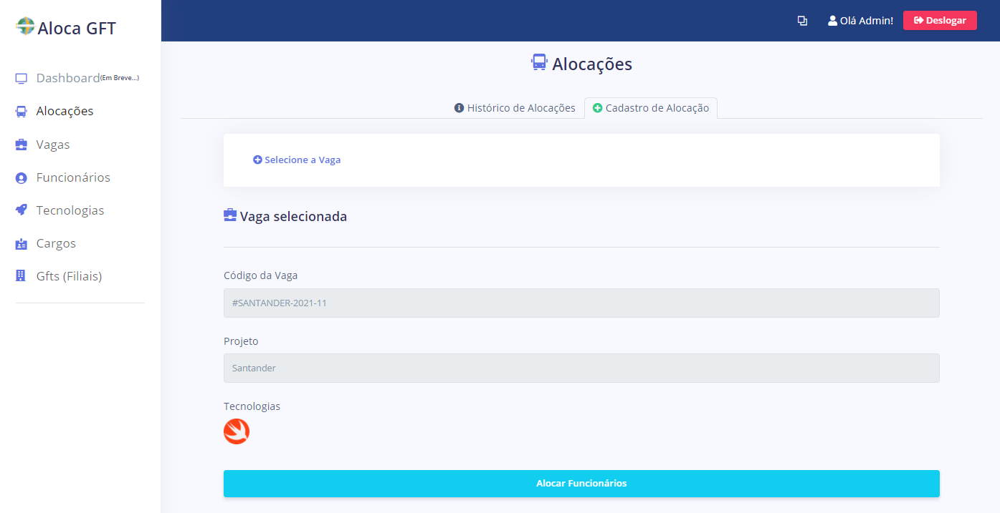
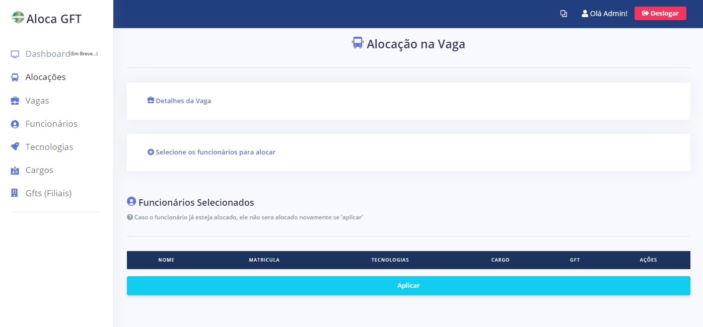
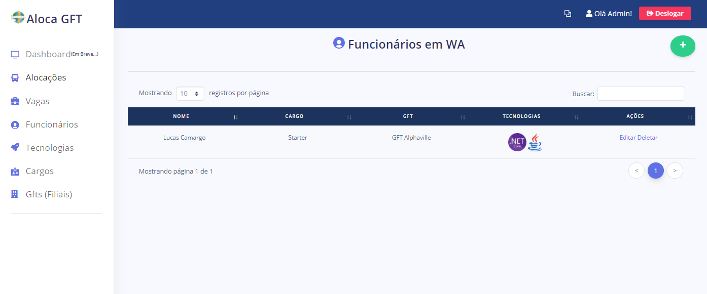
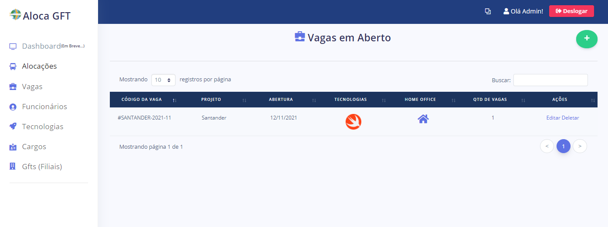
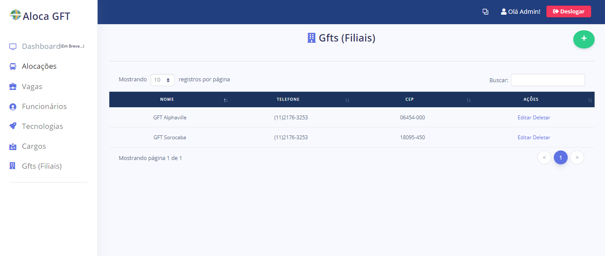
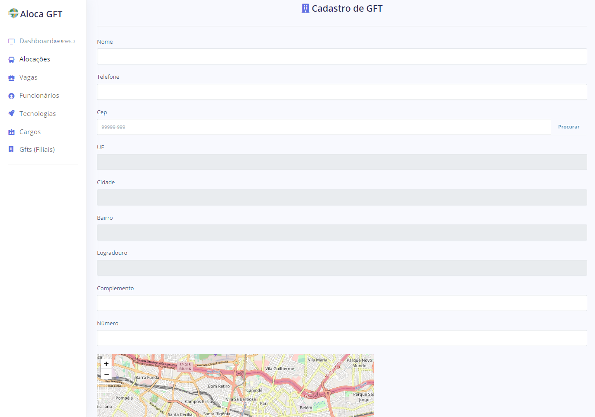
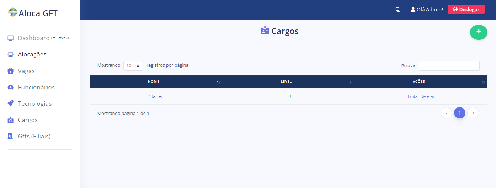
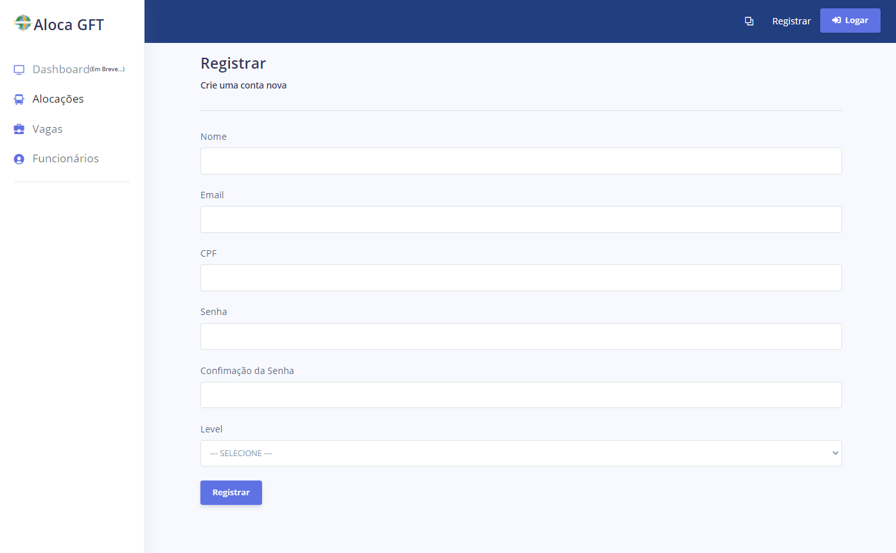

<p align="center">

</p>
<h1 align="center">ALOCA GFT</h1>
<h4 align="center">Sistema de Staffing GFT, no qual controla a alocação de funcionários em vagas, com determinadas tecnologias. Desenvolvido no programa Start, da GFT Brasil</h4>

# 🤔 O que é o programa Start?

Criado pela GFT, o Programa START foi concebido com o objetivo de formar e desenvolver jovens profissionais segundo os valores e competências da GFT. Durante o estágio, os STARTERS, como nossos estagiários são chamados, irão passar por diferentes etapas, de forma a se tornar um profissional preparado a enfrentar os mais diversos desafios.

# 🖥 Prints



<hr>


<hr>



<hr>



<hr>



<hr>



<hr>



<hr>



<hr>



<hr>



<hr>

# 🚀 Executando o projeto

##### 📢  É preciso mudar o endereço do Banco de Dados, mexendo no arquivo **💾appsettings.json** localizado na **raiz do projeto**
##### - Para executar o projeto, é necessário que o MySQL e o Dotnet Core 3.1 (ou superior) estejam instalados na maquina
##### - Para conseguir rodar com o banco de dados, é preciso ter instalado a ferramenta do EFCore (**dotnet tool install --global dotnet-ef**)

```bash
# Entre na pasta do projeto:
$ cd AlocaGFT/

# Digite o comando a seguir, para restaurar as dependências:
$ dotnet restore

# Logo após a instalação das dependências, digite o comando:  -> (somente na primeira vez) <-
$ dotnet ef database update

# Agora, inicie o programa com o comando:
$ dotnet run

# O servidor inciará na porta:5001 - acesse <http://localhost:5001/wa>
```

## ⚙ Para acessar

É necessario se cadastrar no sistema.
Para isso, é preciso clicar no "Registrar", localizado no canto superior direito


# 💡 Tecnologias

Esse projeto foi desenvolvido com as seguintes tecnologias:

- [ASPNet Core 3.1](https://dotnet.microsoft.com/download/dotnet-core/3.1)
- [Entity Framework](https://www.entityframeworktutorial.net/what-is-entityframework.aspx)
- [Identity](https://docs.microsoft.com/pt-br/aspnet/core/security/authentication/identity?view=aspnetcore-5.0)
- [MySQL](https://www.mysql.com/)
- [Bootstrap](https://getbootstrap.com/)

<hr>

